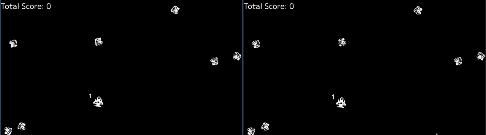

# Asteroids

> [!WARNING]
>
> This repository is a work-in-progress and is not yet production ready.

A classic [Asteroids](https://en.wikipedia.org/wiki/Asteroids_(video_game))-style
multiplayer game implemented using the [Ebiten](https://ebitengine.org)
game engine. The networking layer is built from scratch over
[UDP](https://en.wikipedia.org/wiki/User_Datagram_Protocol) for real-time online
play.

Check out my YouTube video, ["How I Implemented Multiplayer from Scratch in
Golang"](https://youtu.be/G8nxQ9ESIFA), where I walk through the implementation
details and explain my approach to synchronization using snapshot interpolation.



## Installation

### 1. Install Ebiten Dependencies

Before running the game, you need to follow [Ebiten's installation
guide](https://ebitengine.org/en/documents/install.html). If you plan to run
the server on a VPS, make sure [Xvfb](https://en.wikipedia.org/wiki/Xvfb) is
installed and properly configured.

On Ubuntu/Debian systems, you can install it with:

```bash
sudo apt-get update
sudo apt-get install -y xvfb
```

For other platforms, refer to your system's package manager.

### 2. Running the Server

To run the game server, use the following command:

```bash
go run ./cmd/asteroids -listen [ADDR]
```

Replace `[ADDR]` with the address and port you'd like the server to listen on.
For example, to listen on all network interfaces:

```bash
go run ./cmd/asteroids -listen 0.0.0.0:3000
```

### 3. Running the Client

To run the game client, use:

```bash
go run ./cmd/asteroids -connect [ADDR]
```

Replace `[ADDR]` with the address of the server. For example, if the server is
running locally:

```bash
go run ./cmd/asteroids -connect 127.0.0.1:3000
```

Or, if you're connecting to a VPS:

```bash
go run ./cmd/asteroids -connect ip.of.your.vps:3000
```

## How to Play

Take control of your ship and survive the asteroid field! Here's how to navigate
and fight:

### Controls

- <kbd>W</kbd> – Thrust forward
- <kbd>S</kbd> – Thrust backward
- <kbd>A</kbd> – Rotate left
- <kbd>D</kbd> – Rotate right
- <kbd>Space</kbd> – Fire your weapon

### Objective

- Destroy as many asteroids as you can without getting hit!
- Stay agile and keep moving — survival depends on your reflexes and aim.

Good luck, pilot! 🚀

## Resources

I used the following materials during the development of this project:

- [Networked Physics](https://gafferongames.com/categories/networked-physics)
- [Network Programming with Go](https://amazon.com/Network-Programming-Go-Adam-Woodbeck/dp/1718500882)

## License

This project is licensed under the
[MIT](https://github.com/utilyre/go-asteroids/blob/main/LICENSE) license.
