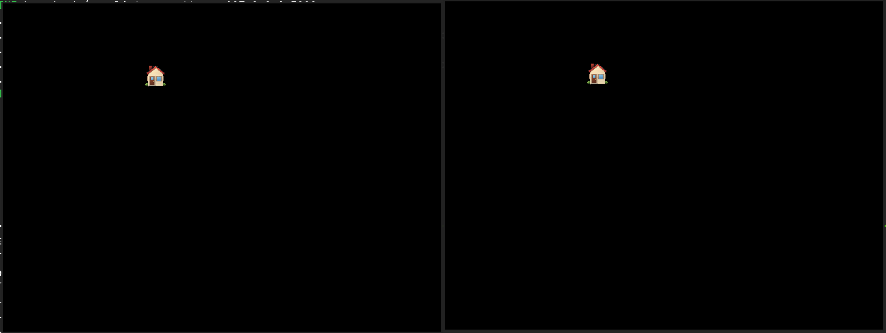

# Multiplayer

> [!WARNING]
>
> This repository is a work-in-progress and subject to ongoing updates.

Multiplayer online game from scratch.

## Development

1. [Install ebitengine dependencies][ebitengine_install].

2. Run the server.

   ```bash
   go run ./cmd/server
   ```

3. In the server logs, there will be a line similar to the one below. Copy the
   text that is in the place of `[ADDRESS]` for the next step.

   ```
	 11:10:53 INF bound udp/mcp listener address=[ADDRESS]
	 ```

3. In the following command, replace `<n>` with the number of clients you would
   like to spawn. Also, paste what you copied from the previous step and then
   execute this command.

   ```bash
   ./spawn_clients.sh <n> -remote=[ADDRESS]
   ```

[ebitengine_install]: https://ebitengine.org/en/documents/install

## Resources

I have used the following materials during the development of this project.

- [Networked Physics](https://gafferongames.com/categories/networked-physics)
- [Sneaky Race Conditions and Granular Locks](https://blogtitle.github.io/sneaky-race-conditions-and-granular-locks)
- [Network Programming with Go](https://www.amazon.com/Network-Programming-Go-Adam-Woodbeck/dp/1718500882)
